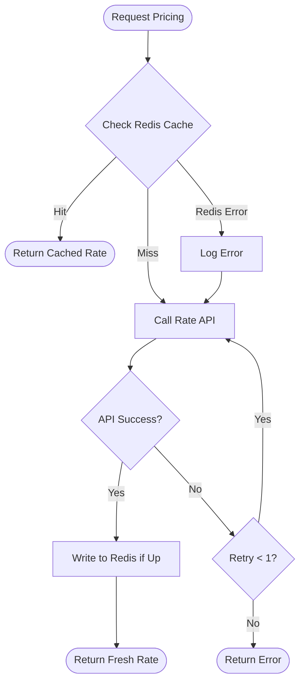

# Optimal Pricing Server

This server caches prices for upto 5 mins to reduce the pressure on the model runs thereby maximising savings for the cost of maintenance.
This document outlines the recent additions to the Optimal Pricing Server, specifically focusing on the implementation of Redis caching for the pricing service.

## Caching Logic for Ratings API

To optimize performance and reduce latency, we have introduced a caching layer using Redis before making calls to the external Ratings API. This mechanism helps us serve pricing information faster and minimizes redundant API requests.

## Workflow
### Visual Flow




## Design Decisions & Thought Process


1.  **Cache Key Generation**: For each pricing request, a unique cache key is generated using the `hotel`, `room`, and `period` parameters. The format of the key is `rate:<hotel>:<room>:<period>`.

2.  **Cache Lookup**: Before making a call to the `RateApiClient`, the system first checks if a valid entry exists in the Redis cache for the generated key.

3.  **Cache Hit**: If a cached value is found (a "cache hit"), the pricing information is retrieved directly from Redis and returned to the client. This avoids the need for an external API call. The log will show a `CACHE HIT` message.

4.  **Cache Miss**: If no cached value is found (a "cache miss"), the system proceeds to call the `RateApiClient` to fetch the current rate.
    - Upon a successful API response, the retrieved rate is stored in the Redis cache with an expiration time of 5 minutes.
    - The fresh rate is then returned to the client.
    - The log will show a `CACHE MISS` message, followed by a `WRITING TO CACHE` message.

5.  **Error Handling**: If the `RateApiClient` call fails, an error is logged, and no value is written to the cache.


## Design Decisions & Thought Process

### Cache Choice
*   **Redis vs. In-Memory**: We chose Redis assuming atleast 2 instances for High availability and to allow the cache to persist across application restarts and to be shared when we further scale the web service horizontally.

### Retry logic selection
We opted for a simple retry mechanism (1 retry) rather than complex exponential backoff for this iteration, as the 5-minute validity window suggests we should fail fast and let the user try again later if the system is struggling. Exponential wait times cumulate to multiple of seconds which doesnt sit well for a booking system user. 

### Circuit Breaker Decisison
I considered a Circuit Breaker, but given the scale of 10k requests/day, I chose a straightforward retry-and-timeout pattern to keep the codebase maintainable and avoid over-engineering. I prioritized observability (Prometheus/Logging) so we can monitor the failure rate. If our traffic grows or the API becomes consistently unstable, the metrics I've included will tell us exactly when it’s time to upgrade to a formal Circuit Breaker.

### Prometheus - Monitoring system for adaptive and incremental changes
HELP ruby_pricing_service_events_total Total events in PricingService
TYPE ruby_pricing_service_events_total counter
pricing_service_events_total{event="pricing_service_cache_miss",hotel="FloatingPointResort",room="SingletonRoom",period="Autumn"} 1
pricing_service_events_total{event="pricing_service_api_success",hotel="FloatingPointResort",room="SingletonRoom",period="Autumn"}1
pricing_service_events_total{event="pricing_service_cache_hit",hotel="FloatingPointResort",room="SingletonRoom",period="Autumn"} 1
pricing_service_events_total{event="pricing_service_cache_miss",hotel="FloatingPointResort",room="SingletonRoom",period="Winter"} 1
pricing_service_events_total{event="pricing_service_api_success",hotel="FloatingPointResort",room="SingletonRoom",period="Winter"} 1
pricing_service_events_total{event="pricing_service_cache_hit",hotel="FloatingPointResort",room="SingletonRoom",period="Winter"} 99

### Script testing for 100 automated requests
Ran locally to understand code behaviour on 1. rate api model down, 2. redis down etc and improve upon the same. showcasing my usual coding style to fool proof what i code locally first and foremost.

### Cache Hit Case
We chose to serve data directly from Redis with a strict 5-minute TTL (Time To Live). This decision aligns perfectly with the business rule that rates are valid for 5 minutes. It prioritizes low latency and reduces costs by completely bypassing the expensive inference model for repeated requests.

### Cache Miss Case
On a cache miss, we employ a synchronous "read-through" strategy: fetch from the API, write to cache, and return. We chose this over background population to ensure the user always gets the most up-to-date price immediately, accepting the one-time latency penalty for the first requestor.

### Graceful Degradation (Rate API Down)
If the upstream Pricing Model API is down or timing out, our service catches the exception after a single retry. Instead of crashing or hanging, we return a structured error message. This ensures our proxy remains stable even when the dependent service is failing. This also ensures data is being still served for keys which are a cache hit.

### Graceful Degradation (Redis Down)
In the event of a Redis failure, the system falls back to treating every request as a cache miss. Traffic will flow directly to the Rate API. While this increases latency and cost, it ensures the service remains available to users rather than failing completely due to a cache outage. Alerts can be raised accordingly.

### Circuit Breaker (Future Addition)
Adding a circuit breaker (e.g., `semian` or `stoplight`) around the `RateApiClient` would be highly beneficial. It would prevent cascading failures by stopping requests to the API if it starts failing consistently, allowing the upstream system time to recover and failing fast for our users.
In the case where the API model is down, a circuit breaker facilitates graceful degradation by immediately returning a fallback (or error) instead of waiting for timeouts. This preserves thread pool capacity, ensuring the service remains responsive for other requests (like cache hits) despite the dependency failure.

### Future Enhancements
We could implement "stale-while-revalidate" to serve slightly stale data while fetching fresh rates in the background, further reducing latency. Additionally, adding comprehensive metrics (e.g., Datadog/Prometheus) for cache hit ratios would help in fine-tuning our TTL and timeout settings.

### Future Enhancements (At Scale)
To handle higher loads, we would need to implement "jitter" in our cache expiration times to prevent "thundering herd" issues. We would also consider sharding the Redis instance or using Redis Cluster to distribute memory pressure and handle higher throughput. For highly popular search parameters, we could implement asynchronous prewarming where a background job refreshes the cache just before the 5-minute TTL expires. We would prefer this strategy if the Rate API latency increases significantly or if specific "hot" keys cause noticeable slowdowns for users during cache misses. This avoids the latency penalty for the unlucky user who hits the expired key.


## Setup and Execution

### 1. Build and Run
The application is containerized using Docker. To build and start the services (Rails app, Redis, Rate API, Prometheus):

```bash
docker compose up -d --build
```

### 2. Verify the Application
Once running, the application listens on port 3000. You can test the pricing endpoint with the following command:

```bash
curl 'http://localhost:3000/api/v1/pricing?period=Summer&hotel=FloatingPointResort&room=SingletonRoom'
```

### 3. Running Tests
To run the automated test suite inside the container:

```bash
docker compose exec interview-dev ./bin/rails test
```

### 4. Monitoring
Prometheus is configured to scrape metrics from the application.
- **Prometheus Dashboard**: [http://localhost:9090](http://localhost:9090)
- **Application Metrics**: [http://localhost:9394/metrics](http://localhost:9394/metrics)

